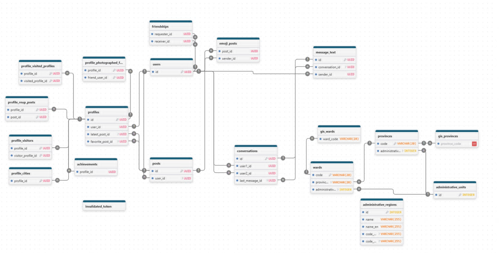

# 📱 Pando

<div align="center">


[](https://example.com)
[](https://www.oracle.com/java/)
[](https://spring.io/projects/spring-boot)
[](https://www.docker.com/)

**Pando là nền tảng kết nối bạn bè bằng khoảnh khắc đời thường, tin nhắn realtime và AI hỗ trợ kiểm duyệt nội dung.**

[Giới Thiệu](#-giới-thiệu) • [Tính Năng Chính](#-tính-năng-chính) • [Kiến Trúc](#-kiến-trúc) • [Công Nghệ](#-công-nghệ-sử-dụng) • [Cài Đặt Local](#-cài-đặt-local)

</div>

---

## 📖 Giới Thiệu

Pando hướng tới việc tạo ra một không gian chia sẻ đơn giản và riêng tư cho bạn bè, gia đình và các mối quan hệ thân thiết. Ứng dụng giúp người dùng duy trì kết nối hàng ngày bằng cách chia sẻ khoảnh khắc, vị trí và tin nhắn một cách nhanh chóng.

### 🎯 Mục tiêu sản phẩm

- Xây dựng nền tảng kết nối bạn bè thân thiết, tập trung vào khoảnh khắc đời thường.
- Tạo trải nghiệm chia sẻ nhanh, ít friction và an toàn.
- Kết hợp vị trí, media và realtime để tạo cảm giác kết nối tự nhiên.
- Tăng tính bảo mật bằng AI kiểm duyệt nội dung và nhận diện khuôn mặt.
- Giúp người dùng duy trì trò chuyện và cập nhật hoạt động một cách dễ dàng.

### 👥 Đối tượng sử dụng

- Người dùng muốn chia sẻ hình ảnh và khoảnh khắc với bạn bè thân thiết.
- Nhóm bạn bè, gia đình hoặc cộng đồng nhỏ cần cập nhật hoạt động hàng ngày.
- Người dùng cần một mạng xã hội riêng tư, ít phô trương nhưng nhiều tương tác.

---

## ✨ Tính Năng Chính

### 🔐 Đăng ký & Đăng nhập

- Đăng ký tài khoản và xác thực bằng email/OTP.
- Đăng nhập, refresh token và đăng xuất.
- Quên mật khẩu và reset mật khẩu.

### 👥 Quản lý bạn bè

- Tìm kiếm người dùng và gửi lời mời kết bạn.
- Chấp nhận, từ chối hoặc hủy lời mời kết bạn.
- Xem danh sách bạn bè và quản lý mối quan hệ.
- Xóa bạn bè khi cần.

### 📸 Chia sẻ hình ảnh & khoảnh khắc

- Chụp ảnh trực tiếp hoặc upload ảnh từ thư viện.
- Gắn vị trí địa lý vào bài đăng.
- Xem lại lịch sử bài đăng và khoảnh khắc đã chia sẻ.
- Tương tác với bài đăng bằng reaction và comments (đang phát triển).

### 💬 Nhắn tin realtime

- Gửi và nhận tin nhắn 1-1 giữa bạn bè.
- Đồng bộ tin nhắn theo thời gian thực.
- Xem lịch sử trò chuyện và trạng thái tin nhắn.
- Nhận thông báo khi có tin nhắn mới.

### 🗺️ Bản đồ & vị trí

- Hiển thị vị trí người dùng và bạn bè trên bản đồ.
- Gắn tọa độ vào bài đăng và hiển thị check-in.
- Dẫn đường nhanh tới vị trí của bài đăng.
- Xem thông tin địa điểm liên quan đến bài đăng.

### 🧠 AI & kiểm duyệt

- Kiểm tra ảnh NSFW tự động trước khi chia sẻ.
- Nhận diện khuôn mặt và trích xuất embedding cho tìm kiếm.
- Hỗ trợ kiểm duyệt nội dung và bảo vệ người dùng.
- Tách luồng xử lý AI cho hình ảnh và nhận diện khuôn mặt.

### 📰 Widget & thông báo

- Widget cập nhật bài đăng mới ngay trên màn hình chính.
- Gửi thông báo kết bạn, tin nhắn và hoạt động mạng xã hội.
- Widget hỗ trợ thao tác mở nhanh và chỉ đường.

---

## 🏗️ Kiến Trúc

Pando được xây dựng theo mô hình backend monolith, kết hợp REST API, WebSocket/SSE, và các dịch vụ phụ trợ để tạo ra trải nghiệm realtime và media mượt mà.

### Thành phần chính

- Mobile/Web client: gửi yêu cầu REST và kết nối realtime.
- Nginx: reverse proxy, HTTPS, route và bảo mật.
- Spring Boot backend: xử lý auth, bạn bè, chat, bài đăng, location, notification.
- PostgreSQL / PostGIS: dữ liệu người dùng, bài viết, friendship, địa lý.
- Redis: cache, token và state tạm thời.
- RabbitMQ: xử lý job bất đồng bộ như moderation, email và notification.
- MinIO: lưu trữ ảnh và media.
- Qdrant: lưu trữ vector embedding khuôn mặt.
- External systems: Firebase FCM, SMTP email, AI service.

### Hệ thống high level


> Kiến trúc high level của Pando, bao gồm client, reverse proxy, backend và các dịch vụ phụ trợ.

### ERD cơ sở dữ liệu



> Sơ đồ ERD thể hiện các bảng người dùng, bài đăng, bạn bè, hội thoại và dữ liệu địa lý.

---

## 💻 Công Nghệ Sử Dụng

| Nhóm | Công nghệ |
| --- | --- |
| Backend | Java 17, Spring Boot 3.5 |
| Auth & bảo mật | Spring Security, JWT |
| ORM | Spring Data JPA, Hibernate |
| Database | PostgreSQL, PostGIS |
| Cache | Redis |
| Message Broker | RabbitMQ |
| Storage | MinIO |
| Vector DB | Qdrant |
| Realtime | WebSocket, SSE, STOMP |
| AI | InsightFace, Hugging Face Transformers, PyTorch |
| CI/CD | GitHub Actions |
| Container | Docker, Docker Compose |

---

## 💻 Cài Đặt Local

### Yêu cầu

- Java 17+
- Maven 3.8+
- Docker & Docker Compose
- Python 3.10+ (AI service)

### Chạy nhanh

```bash
git clone <repository-url>
cd lockly
cp .env.example .env
./mvnw clean package
docker compose up -d
```

> Cập nhật các biến môi trường DB, Redis, RabbitMQ, MinIO, JWT và AI service trước khi chạy.

---

## 🧪 Kiểm Thử

- Unit test: `./mvnw test`
- Chạy service bằng Docker Compose và kiểm tra endpoints

---

## 🌱 Roadmap

### ✅ Đã hoàn thành

- Đăng ký/đăng nhập, OTP, refresh token
- Quản lý bạn bè và hội thoại realtime
- Chia sẻ ảnh, bài đăng và vị trí
- Kiểm duyệt AI cho nội dung NSFW
- Widget và notification realtime

### 🚧 Đang phát triển

- Tính năng thành tựu người dùng và cup định kỳ
- Kết nối bảo mật khuôn mặt đăng ký
- Nâng cấp trải nghiệm gợi ý và cá nhân hóa
- Mở rộng tương tác trên bản đồ và báo gần nhau

