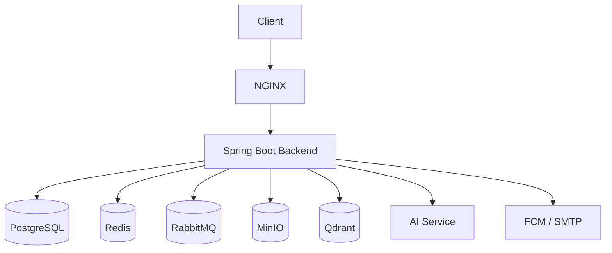

# High Level Design - Lockly

## 1. System context
Lockly là một nền tảng mạng xã hội thời gian thực chạy trên backend hiện tại bằng Spring Boot, tương tác với nhiều hệ thống phụ trợ để hỗ trợ xác thực, lưu trữ media, realtime, AI moderation và monitoring.

### Hệ thống nằm ở đâu
- Ứng dụng chính chạy ở tầng backend: Spring Boot service
- Client truy cập qua web/mobile thông qua Nginx
- Hệ thống phụ thuộc vào các dịch vụ bên ngoài và nội bộ như database, cache, message broker, object storage, AI service, push notification và email

### Tương tác với hệ thống nào
- Client: mobile/web app
- Reverse proxy / ingress: Nginx
- Backend service: Spring Boot API + WebSocket/SSE
- Data stores: PostgreSQL, PostgreSQL GIS, Redis, MinIO, Qdrant
- Messaging/async: RabbitMQ
- External systems: Firebase Cloud Messaging, SMTP email, AI service
- Observability: Prometheus, Loki, Grafana

---

## 2. Main components / services

### 2.1 Client layer
- Mobile/Web client gọi API REST và kết nối WebSocket/SSE
- Gửi request cho auth, social, chat, post, notification

### 2.2 API gateway / ingress
- Nginx đóng vai trò reverse proxy, route request và bảo vệ đầu vào

### 2.3 Core application service
Backend Spring Boot gồm các module chính:
- Auth service: đăng ký, đăng nhập, OTP, refresh token, logout
- User/Profile service: thông tin hồ sơ, trạng thái online, cài đặt
- Friendship service: gửi/chấp nhận/từ chối kết bạn
- Conversation/Message service: tạo hội thoại, gửi tin nhắn, realtime sync
- Post/Feed service: tạo bài viết, upload media, emoji, feed bạn bè
- Location service: lưu và truy vấn vị trí địa lý
- Notification service: push message, email, realtime notification
- AI integration service: gọi AI moderation và face embedding pipeline

### 2.4 Supporting services
- Redis: cache, token/session, transient state
- RabbitMQ: xử lý task bất đồng bộ như notification, moderation, email
- MinIO: lưu ảnh/media
- Qdrant: lưu vector embedding cho face recognition/search
- PostgreSQL: database chính
- PostgreSQL GIS: database địa lý

### 2.5 Operational services
- Prometheus: thu thập metrics
- Loki/Grafana: thu thập log và dashboard
- Health checks: kiểm tra trạng thái database, cache, storage, broker

---

## 3. Data flow

### 3.1 Authentication flow
1. Client gửi request đăng nhập/đăng ký tới Nginx
2. Backend xác thực dữ liệu và tạo JWT
3. Token được lưu/truy vấn qua Redis
4. Client nhận access/refresh token và dùng cho các request tiếp theo

### 3.2 Post creation flow
1. Client upload ảnh và metadata bài viết
2. Backend lưu file vào MinIO
3. Backend ghi metadata bài viết vào PostgreSQL
4. Backend gửi event moderation tới RabbitMQ
5. Worker xử lý AI moderation và cập nhật trạng thái bài viết

### 3.3 Realtime chat flow
1. Client kết nối WebSocket/SSE tới backend
2. Backend validate token và đăng ký session
3. Khi có tin nhắn mới, backend lưu vào PostgreSQL
4. Backend phát event tới client connected và các bên liên quan
5. Notification có thể được gửi qua FCM hoặc email nếu cần

### 3.4 Friendship and notification flow
1. Client gửi lời mời kết bạn
2. Backend cập nhật bảng friendship trong PostgreSQL
3. Backend tạo notification event
4. RabbitMQ phân phối cho worker xử lý push notification qua FCM/email

---

## 4. API / interface giữa các component

### 4.1 Client ↔ Backend
- REST API cho các chức năng CRUD, auth, profile, post, friendship, location
- WebSocket/SSE cho realtime messaging và notification

### 4.2 Backend ↔ Database
- JPA/Hibernate dùng để thao tác với PostgreSQL và PostgreSQL GIS
- Redis client dùng cho cache và transient state

### 4.3 Backend ↔ Storage
- MinIO SDK để upload/download object
- Qdrant client để lưu/truy vấn vector embedding

### 4.4 Backend ↔ Message queue
- RabbitMQ producer/consumer để gửi và nhận async task

### 4.5 Backend ↔ External systems
- Firebase Admin SDK để push notification
- SMTP client để gửi email
- HTTP client để gọi AI service

### 4.6 Example interfaces
- Auth API: POST /auth/register, POST /auth/login, POST /auth/refresh
- User API: GET /users/{id}, PATCH /users/profile
- Post API: POST /posts, GET /posts/{id}, GET /feed
- Chat API: POST /conversations, POST /messages, WS /ws/chat

---

## 5. Database / storage

### 5.1 Relational database
- PostgreSQL main database lưu:
  - users, profiles
  - friendships
  - conversations, messages
  - posts, comments, reactions
  - auth/session metadata

### 5.2 GIS database
- PostgreSQL với PostGIS dùng cho:
  - địa điểm bài viết
  - dữ liệu địa lý và tìm kiếm theo khu vực

### 5.3 Cache / session store
- Redis lưu:
  - JWT/session state
  - temporary cache cho feed/profile
  - rate limit hoặc short-lived state

### 5.4 Object storage
- MinIO lưu:
  - ảnh bài viết
  - avatar và media khác
  - file upload từ người dùng

### 5.5 Vector database
- Qdrant lưu embedding từ AI service để phục vụ face recognition/search

---

## 6. Message queue / event bus
RabbitMQ được dùng để tách các tác vụ không cần block request response khỏi luồng chính.

### Các event thường dùng
- post.moderation.request
- notification.push.request
- email.send.request
- user.activity.updated

### Lợi ích
- giảm latency cho API
- tăng độ tin cậy khi xử lý background job
- dễ mở rộng worker theo nhu cầu

---

## 7. External systems
- Firebase Cloud Messaging: gửi push notification tới client
- SMTP server: gửi OTP và thông báo email
- AI service: xử lý ảnh NSFW và embedding khuôn mặt
- Nginx/HTTPS infrastructure: expose service ra internet

---

## 8. Authentication / authorization
- JWT access token + refresh token
- Spring Security filter chain xử lý authentication/authorization
- Một số endpoint cần role/ownership check, ví dụ chỉ chủ sở hữu mới sửa profile hoặc xoá bài viết
- Các request bảo mật cần validate token và kiểm tra quyền sở hữu dữ liệu

### Security considerations
- HTTPS ở Nginx
- Secret config qua environment variables
- Token lưu an toàn và rotate hợp lý
- Upload file cần kiểm duyệt và giới hạn kích thước

---

## 9. Deployment / infrastructure (high level)
- Dịch vụ chạy trên containerized environment bằng Docker Compose
- Nginx expose service tới client
- Backend, database, cache, broker, storage chạy trong cùng Docker network
- Prometheus/Loki/Grafana theo dõi toàn bộ hệ thống

### Deployment topology

---

## 10. Assumptions, dependencies và điểm cần quyết định

### Assumptions
- Backend là service chính và hiện tại chưa tách riêng AI service thành microservice độc lập
- Client có thể kết nối WebSocket/SSE
- Hệ thống có thể dùng Docker Compose cho môi trường phát triển và staging
- PostgreSQL đủ đáp ứng cho MVP social app

### Dependencies
- Java 17, Spring Boot 3.5
- PostgreSQL + PostGIS
- Redis
- RabbitMQ
- MinIO
- Qdrant
- Firebase Admin SDK
- SMTP server

### Points to decide
- Có nên tách AI service ra thành service riêng ngay từ bây giờ không?
- Có nên dùng Kafka thay cho RabbitMQ không?
- Có nên dùng managed cloud services (Azure/AWS/GCP) thay cho self-hosted containers không?
- Có nên tách read/write database hoặc dùng cache layer sâu hơn cho feed không?
- Mức độ bảo mật và compliance cần đạt cho production (ví dụ secret management, audit log, encryption)

---

## 11. Summary
Lockly là một hệ thống backend social platform hiện đại, gồm các thành phần chính: API service, realtime layer, relational + GIS database, cache, object storage, vector DB, message queue và AI integration. Thiết kế hiện tại phù hợp cho MVP và có thể mở rộng theo hướng event-driven và service-oriented trong tương lai.
